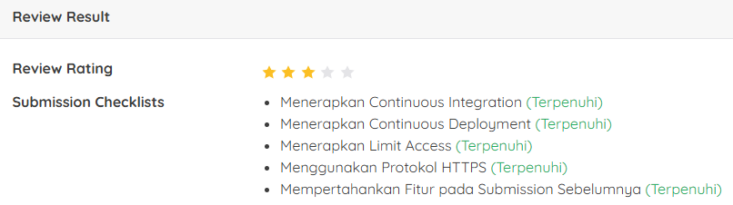

# Proyek Pertama: Menjadi Back-End Developer Expert dengan JavaScript
## Penilaian Proyek
Proyek ini berhasil mendapatkan bintang ?/5 pada submission dicoding course Menjadi Back-End Developer Expert dengan JavaScript.



Kriteria tambahan yang saya kerjakan sehingga mendapatkan nilai terbaik:
1. 
2. 
3. 

# 📌 Forum API

Forum API adalah backend API untuk aplikasi forum yang memungkinkan pengguna untuk **membuat akun, login, membuat thread, mengomentari thread, serta menambahkan balasan pada komentar** dengan menerapkan **Clean Architecture** dan **Automation Testing** menggunakan **Jest**.

---

## ✨ **Fitur yang Tersedia**

✅ **User Management** (Registrasi, Login, Logout) ✅ **Thread Management** (Menambahkan, Melihat Thread) ✅ **Comment Management** (Menambahkan, Menghapus Komentar pada Thread) ✅ **Reply Management** (Menambahkan Balasan pada Komentar) ✅ **Authentication** (JWT Authentication) ✅ **Automation Testing** (Unit & Integration Testing dengan Jest) ✅ **Database Migration** (Menggunakan `node-pg-migrate`)

---

## 🚀 **Cara Menjalankan Proyek**

### 1️⃣ **Persiapan Database**

#### **📌 Cara Membuat User PostgreSQL**

1. Masuk ke PostgreSQL sebagai `postgres`:
   ```sh
   sudo -u postgres psql
   ```
2. Buat user baru:
   ```sql
   CREATE USER developer WITH PASSWORD 'supersecretpassword';
   ```
3. Beri hak akses superuser:
   ```sql
   ALTER USER developer WITH SUPERUSER;
   ```
4. Buat database untuk user:
   ```sql
   CREATE DATABASE developer OWNER developer;
   ```

#### **📌 Cara Membuat Database Forum API**

1. Masuk ke PostgreSQL sebagai `developer`:
   ```sh
   psql -U developer
   ```
2. Buat database:
   ```sql
   CREATE DATABASE forumapi;
   CREATE DATABASE forumapi_test;
   ```

### 2️⃣ **Menjalankan Migrasi Database**

1. **Membuat migrasi baru**:
   ```sh
   npm run migrate create "create table users"
   npm run migrate create "create table authentications"
   ```
2. **Menjalankan migrasi**:
   ```sh
   npm run migrate up
   npm run migrate:test up
   ```

### 3️⃣ **Menjalankan Server**

1. **Instal dependencies**:
   ```sh
   npm install
   ```
2. **Jalankan server**:
   ```sh
   npm run start
   ```

---

## 📌 **Struktur Proyek**

```bash
C:.
|   .env
|   .gitignore
|   package-lock.json
|   package.json
|   README.md
|   struktur_proyek.txt
|   
+---config
|   \---database
|           test.json
|                 
+---migrations
|       1627983516963_create-table-users.js
|       1627983555473_create-table-authentications.js
|       1740899905329_create-table-threads.js
|       1740900890574_create-table-comments.js
|       1740901570792_update-table-comments.js
|
+---postman
|       Forum API V1 Test.postman_collection.json
|       Forum API V1 Test.postman_environment.json
|
+---src
|   |   app.js
|   |   
|   +---Applications
|   |   +---security
|   |   \---use_case
|   |       |   AddCommentUseCase.js
|   |       |   AddThreadUseCase.js
|   |       |   DeleteCommentUseCase.js
|   |       |   GetThreadDetailsUseCase.js
|   |       |
|   +---Commons
|   |   \---exceptions
|   |
|   +---Domains
|   |   +---authentications
|   |   +---comments
|   |   +---threads
|   |   +---users
|   |
|   +---Infrastructures
|   |   |   container.js
|   |   +---database
|   |   +---http
|   |   \---repository
|   |
|   \---Interfaces
|       \---http
|           \---api
|               +---authentications
|               +---comments
|               +---threads
|               \---users
\---tests
        AuthenticationsTableTestHelper.js
        CommentsTableTestHelper.js
        ThreadsTableTestHelper.js
        UsersTableTestHelper.js
```

---

## 🔥 **Pengujian (Automation Testing dengan Jest)**

### ✅ **Menjalankan Seluruh Pengujian**

```sh
npm test -- --coverage
```

### ✅ **Menjalankan Pengujian Individual**

Misalnya, hanya ingin menguji `AddCommentUseCase.test.js`:

```sh
npm test -- Applications/use_case/_test/AddCommentUseCase.test.js
```

---

## 📮 **API Endpoint Documentation (Postman)**

Koleksi Postman tersedia di folder ``:

- **Import file berikut ke Postman**:
  - `Forum API V1 Test.postman_collection.json`
  - `Forum API V1 Test.postman_environment.json`

---

## 🛠 **Teknologi yang Digunakan**

- **Node.js** 🚀
- **Hapi.js** 🎯 (Framework backend)
- **PostgreSQL** 🗄️ (Database)
- **Jest** 🧪 (Unit & Integration Testing)
- **JWT** 🔐 (Authentication)
- **Node-PG-Migrate** 📦 (Migration Tool)

📌 **Selamat Coding!** 😃🔥

